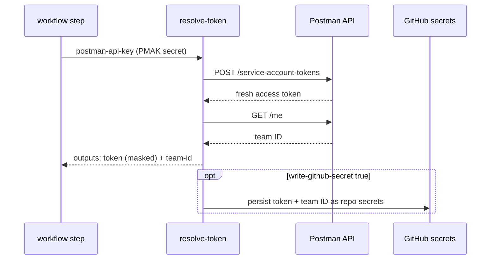

# Postman Onboarding: Service Token

[](https://github.com/postman-cs/postman-resolve-service-token-action/actions/workflows/ci.yml) [](https://github.com/postman-cs/postman-resolve-service-token-action/releases) [](https://www.npmjs.com/package/@postman-cse/onboarding-resolve-service-token) [](LICENSE)

Recommended credential producer for the Postman API Onboarding suite. It mints a fresh service-account access token and team ID in CI, ready to hand to the onboarding action or store as repo secrets.

Part of the [Postman API Onboarding suite](https://github.com/postman-cs/postman-api-onboarding-action).

## Quick start

Use this action before `postman-api-onboarding-action`. Set `postman-region` to the [data residency](https://learning.postman.com/docs/administration/enterprise/about-eu-data-residency/) region for the target Postman team.

```yaml
jobs:
  onboarding:
    runs-on: ubuntu-latest
    permissions:
      actions: write
      contents: write
    steps:
      - uses: actions/checkout@v5

      - id: postman_token
        uses: postman-cs/postman-resolve-service-token-action@v2
        with:
          postman-api-key: ${{ secrets.POSTMAN_API_KEY }}
          postman-region: us

      - uses: postman-cs/postman-api-onboarding-action@v2
        with:
          project-name: core-payments
          spec-url: https://raw.githubusercontent.com/postman-cs/postman-resolve-service-token-action/main/examples/core-payments-openapi.yaml
          postman-api-key: ${{ secrets.POSTMAN_API_KEY }}
          postman-access-token: ${{ steps.postman_token.outputs.token }}
          postman-team-id: ${{ steps.postman_token.outputs.team-id }}
          postman-region: us
```

The step emits `outputs.token` and `outputs.team-id` for downstream steps. `postman-api-key` must be a [Postman service account](https://learning.postman.com/docs/administration/service-accounts/) PMAK; the underlying `/service-account-tokens` endpoint rejects personal user keys.

## Which action should I use?

| Action | Use when | Consumes | Produces |
| --- | --- | --- | --- |
| [Postman Onboarding: Service Token](https://github.com/postman-cs/postman-resolve-service-token-action) | You need CI-safe Postman credentials for any onboarding workflow | Service-account PMAK | Access token, team ID |
| [Postman API Onboarding](https://github.com/postman-cs/postman-api-onboarding-action) | You want the full onboarding pipeline in one composite action | API key, access token, team ID, OpenAPI spec | Workspace, API, repo artifacts, optional Insights link |
| [Postman Onboarding: AWS Spec Discovery](https://github.com/postman-cs/postman-aws-spec-discovery-action) | Your OpenAPI spec should be discovered from AWS before onboarding | AWS credentials | Spec URL or spec path |
| [Postman Onboarding: Workspace Bootstrap](https://github.com/postman-cs/postman-bootstrap-action) | You only need workspace creation, spec upload, and collection generation | API key, access token, team ID, OpenAPI spec | Workspace ID, API ID, collection IDs |
| [Postman Onboarding: Smoke Flow](https://github.com/postman-cs/postman-smoke-flow-action) | You need to apply a curated flow.yaml to the generated Smoke collection | Bootstrap outputs, API key, flow.yaml | Refreshed Smoke collection |
| [Postman Onboarding: Repo Sync](https://github.com/postman-cs/postman-repo-sync-action) | You only need generated artifacts committed back to the repo | Bootstrap outputs | `.postman/` resources, collections, CI templates |
| [Postman Onboarding: Insights Linking](https://github.com/postman-cs/postman-insights-onboarding-action) | You only need to link an Insights service to a workspace | Workspace and service identifiers | Insights link state |

## Region and stack

Most workflows only need `postman-region`. Use `us` unless your Postman team uses [EU data residency](https://learning.postman.com/docs/administration/enterprise/about-eu-data-residency/).

| Setting | API host | Notes |
| --- | --- | --- |
| `postman-region: us` | `https://api.getpostman.com` | Default public Postman API host |
| `postman-region: eu` | `https://api.eu.postman.com` | EU data residency host |

## Authentication matrix

| Path | Use for | Required inputs | Permissions and expiry | Notes |
| --- | --- | --- | --- | --- |
| Service-account minting | Recommended path for onboarding workflows | `postman-api-key` from `POSTMAN_API_KEY` | The PMAK must belong to a [Postman service account](https://learning.postman.com/docs/administration/service-accounts/). The access token is fresh every run. | Pass `outputs.token` as `postman-access-token` and `outputs.team-id` as `postman-team-id`. |
| Scheduled repo-secret refresh | Existing workflows that read `POSTMAN_ACCESS_TOKEN` and `POSTMAN_TEAM_ID` from secrets | `postman-api-key`, `write-github-secret`, `github-token` | `github-token` must be a PAT or GitHub App installation token with repository secrets write permission. The stored token is replaced on schedule. | The default workflow `GITHUB_TOKEN` cannot write repository secrets. |
| GitHub handoff only | Normal composite onboarding after token minting | `${{ github.token }}` passed to downstream `github-token` | `GITHUB_TOKEN` is job-scoped. Grant `contents: write` for generated commits and `actions: write` for generated workflow files. | This action does not need those permissions unless `write-github-secret` is enabled. |
| AWS OIDC plus Postman handoff | AWS Spec Discovery before onboarding | `id-token: write`, AWS role assumption, then this action's `postman-api-key` | AWS credentials are temporary for the job. Grant read-only provider permissions to the AWS role. | Use this action only for the Postman token; AWS discovery consumes the AWS role and passes `spec-path` downstream. |
| Existing access-token pass-through | Temporary compatibility with externally rotated tokens | `postman-access-token`, usually `postman-team-id` | Expiration is managed outside this action. | The action emits a warning because minting from a service-account PMAK is preferred. |
| Postman CLI credential-store fallback | Temporary fallback when service-account minting is not available | Access token read after `postman login` from the [Postman CLI credential store](https://learning.postman.com/docs/postman-cli/postman-cli-auth/) | Session-scoped token expires and needs manual or external refresh. | Migrate to service-account minting for CI when possible. |

When this output feeds the onboarding action, keep downstream `credential-preflight` set to `warn` or `enforce`. Those are the only public modes.

## Examples

### Mint and hand off to the onboarding action

Use a single `uses:` call to feed the onboarding action directly:

```yaml
jobs:
  onboarding:
    runs-on: ubuntu-latest
    permissions:
      actions: write
      contents: write
    steps:
      - uses: actions/checkout@v5

      - id: postman_token
        uses: postman-cs/postman-resolve-service-token-action@v2
        with:
          postman-api-key: ${{ secrets.POSTMAN_API_KEY }}
          postman-region: us

      - uses: postman-cs/postman-api-onboarding-action@v2
        with:
          project-name: core-payments
          spec-url: https://raw.githubusercontent.com/postman-cs/postman-resolve-service-token-action/main/examples/core-payments-openapi.yaml
          postman-api-key: ${{ secrets.POSTMAN_API_KEY }}
          postman-access-token: ${{ steps.postman_token.outputs.token }}
          postman-team-id: ${{ steps.postman_token.outputs.team-id }}
          postman-region: us
```

### Scheduled secret refresh

Run on a schedule with `write-github-secret: 'true'` to rotate `POSTMAN_ACCESS_TOKEN` for downstream workflows that read it from `secrets`:

```yaml
name: Refresh Postman service-account token

on:
  schedule:
    - cron: '0 6 * * *'   # daily at 06:00 UTC
  workflow_dispatch:

jobs:
  refresh:
    runs-on: ubuntu-latest
    steps:
      - uses: postman-cs/postman-resolve-service-token-action@v2
        with:
          postman-api-key: ${{ secrets.POSTMAN_API_KEY }}
          write-github-secret: 'true'
          github-token: ${{ secrets.SECRETS_WRITE_PAT }}
```

Writing repo secrets requires `github-token` to be a PAT or GitHub App installation token with secrets write permission on the target repo; the workflow `GITHUB_TOKEN` cannot write repo secrets and will fail. Recommended: a fine-grained PAT scoped to the target repo with **Secrets: Read and write** plus **Metadata: Read**, stored as a separate secret such as `SECRETS_WRITE_PAT`. If your org restricts fine-grained PATs, a short-lived classic PAT with the `repo` scope works as a fallback.

### Pass through an existing token

Workflows that already store `POSTMAN_ACCESS_TOKEN` as a repo secret can adopt the action without changing downstream steps. When `postman-access-token` is provided, minting is skipped and the value is returned verbatim. The action emits a warning because this path depends on external token rotation. `postman-team-id` likewise skips the `/me` lookup:

```yaml
- id: postman_token
  uses: postman-cs/postman-resolve-service-token-action@v2
  with:
    postman-api-key: ${{ secrets.POSTMAN_API_KEY }}
    postman-access-token: ${{ secrets.POSTMAN_ACCESS_TOKEN }}   # skip mint
    postman-team-id: ${{ secrets.POSTMAN_TEAM_ID }}             # skip /me
```

When both inputs are provided the action is effectively a passthrough with `outputs.skipped == 'true'`. Removing the input values switches the workflow back to fresh minting on every run.

### npm CLI

The same token resolution is available outside GitHub Actions:

```bash
npx @postman-cse/onboarding-resolve-service-token \
  --postman-api-key "$POSTMAN_API_KEY"
```

The CLI prints the action outputs as JSON:

```json
{
  "token": "pma_at_...",
  "team-id": "123456",
  "skipped": "false"
}
```

Flags match the action inputs:

```bash
postman-resolve-service-token \
  --postman-access-token "$POSTMAN_ACCESS_TOKEN" \
  --postman-team-id "$POSTMAN_TEAM_ID" \
  --write-github-secret false
```

Secret persistence via `--write-github-secret true` is GitHub-repo specific and requires `gh`, `GITHUB_REPOSITORY`, and `--github-token`.

## Inputs

<!-- inputs-table:start -->
| Name | Description | Required | Default |
| --- | --- | --- | --- |
| `postman-api-key` | Recommended credential source. Service-account Postman API key (PMAK) used to mint a fresh access token. Required when postman-access-token is not provided. | no |  |
| `postman-access-token` | Compatibility input for externally rotated Postman access tokens. When provided, minting is skipped, this value is returned via outputs.token, and the action warns because fresh service-account minting is preferred. | no |  |
| `postman-team-id` | Optional pre-known Postman team ID. When provided, the team ID lookup is skipped and this value is returned via outputs.team-id. Recommended with postman-access-token pass-through. | no |  |
| `postman-region` | Postman data residency region for public API calls. One of: us or eu. Use the same region as the target Postman team. | no | `us` |
| `write-github-secret` | When 'true', writes the resolved token and team ID to repo secrets named by access-token-secret-name and team-id-secret-name. Requires github-token to be a PAT (or GitHub App installation token) with secrets write permission on the target repo. The default GITHUB_TOKEN cannot write repo secrets. | no | `false` |
| `access-token-secret-name` | Repo secret name to receive the resolved access token. Used only when write-github-secret is 'true'. | no | `POSTMAN_ACCESS_TOKEN` |
| `team-id-secret-name` | Repo secret name to receive the resolved team ID. Used only when write-github-secret is 'true'. | no | `POSTMAN_TEAM_ID` |
| `github-token` | GitHub PAT or App installation token with secrets write permission on the target repo. Required when write-github-secret is 'true'. | no |  |
<!-- inputs-table:end -->

## Outputs

<!-- outputs-table:start -->
| Name | Description |
| --- | --- |
| `token` | Resolved Postman access token. Either minted or passed through from the postman-access-token input. |
| `team-id` | Resolved Postman team ID. Either looked up via /me or passed through from the postman-team-id input. |
| `skipped` | 'true' when minting was skipped because postman-access-token was provided as input. |
<!-- outputs-table:end -->

## How it works

This action is the producer side of the programmatic token flow for [`postman-cs/postman-api-onboarding-action`](https://github.com/postman-cs/postman-api-onboarding-action). It calls the Postman `/service-account-tokens` endpoint with the [service-account](https://learning.postman.com/docs/administration/service-accounts/) PMAK to mint a fresh access token, resolves the team ID via `/me`, and masks the token in logs.



Both lookups honor explicit overrides: a provided `postman-access-token` or `postman-team-id` is returned verbatim and the corresponding API call is skipped, so existing workflows that manage the token externally can adopt the action incrementally. Passing an existing access token emits a warning because service-account minting is the recommended path.

With `write-github-secret: 'true'` the resolved values are also written back to repo secrets (names configurable via `access-token-secret-name` and `team-id-secret-name`), which lets a scheduled run keep secrets fresh for every other workflow in the repo.

Releases follow the stable `v1` channel: immutable `v1.x.y` tags for reproducible pins, a rolling `v1` alias for the latest release, and npm publishes with matching versions and provenance.

## Resources

- [postman-api-onboarding-action](https://github.com/postman-cs/postman-api-onboarding-action): composite action that orchestrates the onboarding pipeline
- [postman-bootstrap-action](https://github.com/postman-cs/postman-bootstrap-action): workspace, spec upload, collections, governance
- [postman-smoke-flow-action](https://github.com/postman-cs/postman-smoke-flow-action): applies a curated flow.yaml to the Smoke collection
- [postman-repo-sync-action](https://github.com/postman-cs/postman-repo-sync-action): artifact sync, environments, mocks, monitors
- [postman-insights-onboarding-action](https://github.com/postman-cs/postman-insights-onboarding-action): Insights-to-workspace linking
- [postman-aws-spec-discovery-action](https://github.com/postman-cs/postman-aws-spec-discovery-action): AWS API and spec discovery
- [@postman-cse/onboarding-resolve-service-token on npm](https://www.npmjs.com/package/@postman-cse/onboarding-resolve-service-token)
- [postman-service-account-onboarding-sample](https://github.com/postman-cs/postman-service-account-onboarding-sample): end-to-end sample workflows
- Postman Learning Center: [service accounts](https://learning.postman.com/docs/administration/service-accounts/), [API authentication](https://learning.postman.com/docs/reference/postman-api/authentication/), [manage API keys](https://learning.postman.com/docs/administration/managing-your-team/managing-api-keys/), [Postman CLI auth](https://learning.postman.com/docs/postman-cli/postman-cli-auth/), [EU data residency](https://learning.postman.com/docs/administration/enterprise/about-eu-data-residency/)
- [Support](SUPPORT.md): where to ask for help
- [Security policy](SECURITY.md): how to report vulnerabilities
- [Release policy](RELEASE_POLICY.md): versioning and tag rules


## Telemetry

This action sends a single non-identifying usage event when a run completes, so the
Postman team can measure adoption across CI systems. The event contains the
action name and version, your Postman team ID, the run outcome, an event
timestamp, the detected CI provider, runner kind, and runner OS, the CI run
identifier and event trigger, a one-way SHA-256 hash of the repository
identifier, the detected git provider (github, gitlab, bitbucket, or
azure-devops), a one-way SHA-256 hash of the VCS organization name, a coarse
account type (service or user), and a coarse ref kind (default-branch, branch,
or tag). Each event also carries a schema version and a constant event marker (always `completion`). The Postman team ID is sent in the clear on a legitimate-interest
basis to measure product adoption.

The `events.pm-cse.dev` endpoint is operated by the Postman Customer Success
Engineering team. Postman, Inc. processes these events only to measure
onboarding adoption in aggregate, retains them only as aggregated counts for
product-adoption trend analysis, and includes no payload field that identifies
an individual person.

It never sends API keys, access tokens, spec content, workspace or repository
names, or any personal data. It is fire-and-forget with a hard
timeout and can never block or fail your pipeline. Corporate HTTP and HTTPS
proxies are honored through the standard `HTTPS_PROXY`, `HTTP_PROXY`, and
`NO_PROXY` environment variables.

Disable it by setting either environment variable in your CI:

```sh
POSTMAN_ACTIONS_TELEMETRY=off
# or the cross-tool standard
DO_NOT_TRACK=1
```

Telemetry is also skipped automatically when no Postman team ID can be resolved.

Events are sent over HTTPS to `https://events.pm-cse.dev/v1/events`. To
allowlist this destination on a restricted network, or to route events to a
collector you operate, set the `POSTMAN_ACTIONS_TELEMETRY_ENDPOINT` environment
variable to your own URL.

## License

[MIT](LICENSE)
